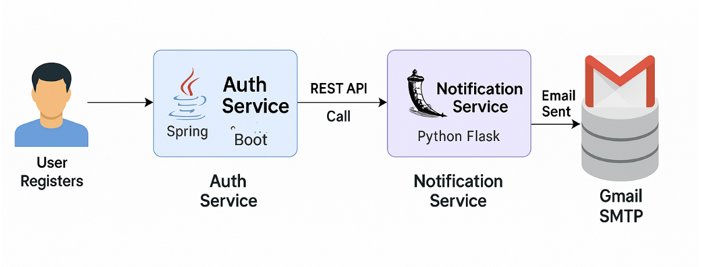

# 📬 Email Notification Service - SkillVerify

This is a standalone **Python-based Email Notification Microservice** that handles sending email notifications (e.g., on successful user registration). It's built using **Flask** and is a part of a larger microservices-based system like `SkillVerify`.

---

## 📌 Use Case

This service is used to notify users via **email** when certain events occur in the system, such as:
- ✅ Successful registration
- 🔒 Password updates
- 🔔 Alerts or system messages

---

## 🛠️ Tech Stack

| Component        | Tech Used            |
|------------------|----------------------|
| Language         | Python               |
| Framework        | Flask                |
| Protocol         | HTTP (REST)          |
| Email Service    | Gmail SMTP           |
| Auth Method      | Google App Password  |
| Frontend Trigger | Spring Boot Backend (Auth Service) |
| Hosting          | Localhost (port 5001) |

---

## 📦 Installed Packages

Install dependencies via:

```bash
pip install Flask
```

Uses:
- `flask` for API handling
- `smtplib`, `email.mime` for SMTP communication

---

## 🔄 Workflow Diagram



---

## 🧠 Flow Description

1. **User registers** in the `Auth-Service` (Spring Boot).
2. If successful, a REST API call is made from `Auth-Service` to the `Notification-Service`:
   ```
   POST http://localhost:5001/send-email
   ```
3. The Flask app receives the request, constructs the email, and sends it using Gmail SMTP.
4. The user receives a confirmation email.

---

## 🚀 API Endpoint

### `POST /send-email`

**Request Body:**
```json
{
  "to_email": "user@example.com",
  "subject": "Registration Successful",
  "message": "Welcome to SkillVerify!"
}
```

**Response:**
- `200 OK`: Email sent successfully
- `500 Internal Server Error`: Failure in sending email

---

## 🔐 Gmail SMTP Configuration

To use Gmail SMTP securely:
1. Enable 2-Step Verification on your Google Account.
2. Go to [App Passwords](https://myaccount.google.com/apppasswords).
3. Generate a new app password for "Other" app (name it like: `Flask Notification Service`).
4. Replace `your-email-password` in the code with the generated app password.

---

## 🔧 Code Structure

```
notification_service/
│
├── notification_service.py   # Main Flask app
├── requirements.txt          # Dependencies (optional)
```

---

## 🧪 Sample Test via curl

```bash
curl -X POST http://localhost:5001/send-email \
  -H "Content-Type: application/json" \
  -d '{
    "to_email": "test@example.com",
    "subject": "Test Email",
    "message": "This is a test from SkillVerify Notification Service"
  }'
```

---

## 🧩 Integration with Spring Boot (Auth Service)

Spring Boot service calls this microservice after user registration using `RestClient`:

```java
restClient.post()
    .uri("http://localhost:5001/send-email")
    .body(emailRequest)
    .retrieve()
    .toEntity(String.class);
```

---

## 🔮 Future Scope

- ✅ Switch to **SendGrid** or **AWS SES** for better reliability
- ✅ Add support for HTML emails
- ✅ Retry logic for failed emails
- ✅ Dockerize the service

---

## 📫 Contact

Developed by **Kanhnu Polai**  
🌱 Aspiring Full Stack Developer | Java | Spring Boot | Python | Microservices | React 

---
